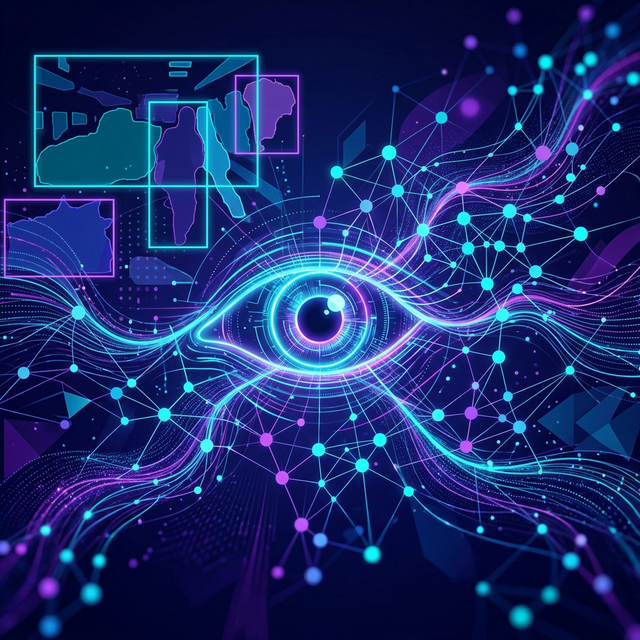

# 👁️ AI Vision Toolkit - NLW Projeto 2




Este projeto é uma exploração prática das fronteiras da Computação Visual e Inteligência Artificial Multimodal, desenvolvido durante o **NLW (Next Level Week)**. O repositório contém uma coleção de notebooks Jupyter que demonstram desde a classificação clássica até a segmentação avançada e integração com LLMs.

---

## 🚀 Funcionalidades

O projeto está dividido em quatro pilares principais, cada um explorando uma técnica de ponta:

1.  **🖼️ Classificação de Imagens (`classificacao_timm.ipynb`)**
    *   Utiliza a biblioteca `timm` (PyTorch Image Models).
    *   Identificação de alta precisão em diversas classes de objetos.
    *   Exemplo de uso com `bird.jpeg`.

2.  **🎯 Detecção de Objetos (`deteccao_yolos.ipynb`)**
    *   Implementação do modelo **YOLOS (You Only Look at One Sequence)** via Hugging Face.
    *   Localização de múltiplos objetos com bounding boxes.
    *   Ideal para cenas complexas como `kitchen.jpeg`.

3.  **✂️ Segmentação Semântica (`segmentacao_clipseg.ipynb`)**
    *   Destaque e isolamento de objetos específicos usando **ClipSeg**.
    *   Permite segmentar partes da imagem através de prompts de texto.

4.  **🤖 Inteligência Multimodal (`gemini_imagem.ipynb`)**
    *   Integração direta com o **Google Gemini API**.
    *   Análise contextual e compreensão de imagens através de prompts avançados.

---

## 🛠️ Tecnologias Utilizadas

Este projeto utiliza o que há de mais moderno no ecossistema Python:

*   **[uv](https://github.com/astral-sh/uv)**: Gerenciador de pacotes e ambientes ultrarrápido.
*   **Python 3.13**: A versão mais recente da linguagem.
*   **PyTorch & Torchvision**: Frameworks base para Deep Learning.
*   **Hugging Face Transformers**: Acesso simplificado a modelos state-of-the-art.
*   **Google GenAI SDK**: Interface para modelos Gemini.
*   **Timm**: Biblioteca especializada em modelos de visão computacional.

---

## ⚙️ Configuração do Ambiente

Este projeto utiliza o `uv` para gestão de dependências. Para configurar o ambiente local:

1.  **Instale o `uv`** (caso não tenha):
    ```powershell
    powershell -ExecutionPolicy ByPass -c "irm https://astral.sh/uv/install.ps1 | iex"
    ```

2.  **Sincronize as dependências**:
    ```bash
    uv sync
    ```

3.  **Configure as variáveis de ambiente**:
    Crie um arquivo `.env` na raiz do projeto e adicione sua chave da API do Google:
    ```env
    GOOGLE_API_KEY=sua_chave_aqui
    ```

4.  **Inicie o Notebook**:
    ```bash
    uv run jupyter notebook
    ```

---

## 📂 Estrutura de Arquivos

*   `imagens/`: Diretório contendo as amostras (bird, kitchen, pizza).
*   `*.ipynb`: Notebooks com as implementações passo a passo.
*   `pyproject.toml`: Configuração do projeto e dependências.
*   `imagenet_classes.txt`: Labels para os modelos de classificação.

---

Desenvolvido com ❤️ no NLW.
